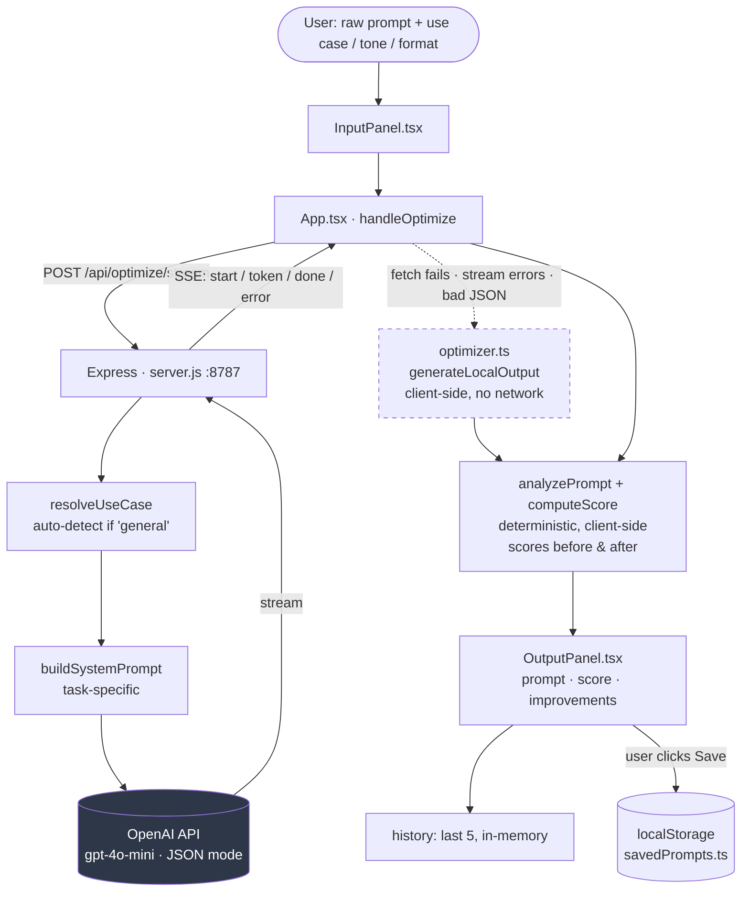

# Architecture

## System diagram

Three things the diagram encodes:

- The frontend never calls OpenAI directly — all model calls go through the Express backend, which holds the API key server-side.
- Scoring is never done by the model. The same functions score the raw and the optimized prompt, so the numbers are comparable.
- The dashed fallback path rejoins at scoring, so the output shape is identical either way.

**Dev-only proxy**: `App.tsx` fetches relative paths (`/api/optimize/stream`), not `http://localhost:8787/...`. In dev, `vite.config.ts` proxies any `/api/*` request from `:5173` to `:8787` (`server.proxy`, `changeOrigin: true`), so the browser only ever talks to one origin and the request never becomes cross-origin. The `cors()` middleware in `server.js` (restricted to `localhost`) only matters if something bypasses this proxy — e.g. calling the backend directly with curl/Postman, or a production deployment where frontend and backend are *not* served from the same origin. A production build has no proxy; if the static frontend and Express backend aren't reverse-proxied under one origin, relative `/api/*` calls will fail and the app silently drops to the local fallback optimizer (see [Fallback path](#fallback-path)) — this is the mechanism behind the root `README.md`'s "frontend-only deployment falls back automatically" note.

## Data flow (happy path)

1. User types a raw prompt in `InputPanel`, picks use case / tone / output format, hits Optimize.
2. `App.tsx` → `handleOptimize()` POSTs to `/api/optimize/stream` and opens an SSE reader.
3. `server.js` resolves the use case (auto-detect if `general`), builds a task-specific system prompt, and streams the OpenAI completion back as `token` events containing just the `"prompt"` field's growing text (parsed out of the partial JSON with a regex, so the UI can render prose before the full JSON object is complete).
4. On `done`, the server has the full parsed/validated JSON (`prompt`, `taskType`, `assumptions`, `improvements`, `missingDetails`).
5. The frontend computes before/after scores locally (`analyzePrompt` + `computeScore` in `optimizer.ts` — scoring is never done by the model) and renders the result in `OutputPanel`.
6. The result is pushed onto in-memory `history` (last 5) and optionally persisted to `localStorage` via `savedPrompts.ts` if the user clicks Save.

## Fallback path

If the fetch fails, the stream errors, or the response is malformed, `handleOptimize()` catches the error and calls `generateLocalOutput()` from `src/lib/optimizer.ts` — a deterministic, template-based optimizer that runs entirely in the browser with no network call. This is why the app "works without an API key": the AI path degrades to the local path silently (no error toast shown to the user).

## Tech stack

| Layer | Choice | Notes |
|---|---|---|
| Frontend framework | React 19 + TypeScript | Vite dev server on `:5173` |
| Styling | Tailwind CSS | utility classes, no CSS-in-JS |
| Icons | lucide-react | |
| Backend | Express 5 (Node.js) | port `:8787`, CORS restricted to `localhost` |
| AI provider | OpenAI API (`openai` SDK) | model configurable via `OPENAI_MODEL`, default `gpt-4o-mini` |
| Transport (AI path) | Server-Sent Events (SSE) | one-directional streaming, simpler than WebSockets for this use case |
| Dev connection | Vite proxy | `/api/*` on `:5173` proxied to `:8787` — see note above |
| Persistence | `localStorage` only | no database; see [Constraints](06-handoff.md#constraints--non-goals) |

## Key files

| File | Responsibility |
|---|---|
| `server.js` | Express app. Builds task-aware system prompts, calls OpenAI, exposes `POST /api/optimize` (non-streaming) and `POST /api/optimize/stream` (SSE). See [05-api-reference.md](05-api-reference.md). |
| `src/lib/types.ts` | All shared TypeScript types: `UseCase`, `Tone`, `OutputFormat`, `OptimizedResult`, `SavedPrompt`, `HistoryItem`, etc. |
| `src/lib/optimizer.ts` | Client-side deterministic optimizer — prompt analysis, scoring (`analyzePrompt`, `computeScore`, `computeScoreBreakdown`), and the local fallback generator with one `build*` function per use case (`buildGeneral`, `buildCoding`, `buildMarketing`, `buildResearch`, `buildBusiness`, `buildGTM`, `buildImage`, `buildWriting`). |
| `src/lib/savedPrompts.ts` | `loadSaved` / `persistSaved` (localStorage read/write) and `computeStats` (word/char/estimated-token count for the output panel). |
| `src/App.tsx` | Top-level state and orchestration: streaming fetch/SSE parsing, history, save/restore, rating/flag feedback. |
| `src/components/InputPanel.tsx` | Prompt textarea, use-case/tone/format controls, example prompt chips, optimize/clear/undo buttons. |
| `src/components/OutputPanel.tsx` | Assumptions panel, streaming text display, score bar, improvements/missing-details tabs, feedback controls. (Note: `result.taskType` is tracked in state but not rendered here — see [06-handoff.md](06-handoff.md#known-gotchas).) |
| `src/components/HistoryDrawer.tsx` | Slide-over with "Recent" (session, ephemeral) and "Saved" (localStorage, persistent) tabs. |
| `src/components/Header.tsx` | App header, opens the history drawer. |
| `.env` | `OPENAI_API_KEY`, `OPENAI_MODEL`, `PORT` — see [04-setup.md](04-setup.md#environment-variables). |

## Design decisions worth knowing

- **Scoring is deterministic, not model-generated.** The same `analyzePrompt`/`computeScore` functions score both the raw and AI-optimized prompt, so scores are comparable and reproducible — the model is never asked to grade itself.
- **Streaming parses partial JSON with regex**, not a streaming JSON parser. `server.js` extracts the `"prompt"` string as it grows using `PROMPT_RE` / `PROMPT_PARTIAL_RE`, because the full JSON payload (assumptions, improvements, etc.) is only complete once the stream ends. This keeps the UI responsive without pulling in a streaming-JSON dependency.
- **The AI fallback is silent.** If the AI path fails for any reason, the user sees a locally-generated result instead of an error — the local optimizer was built specifically to be "good enough" as a safety net.
